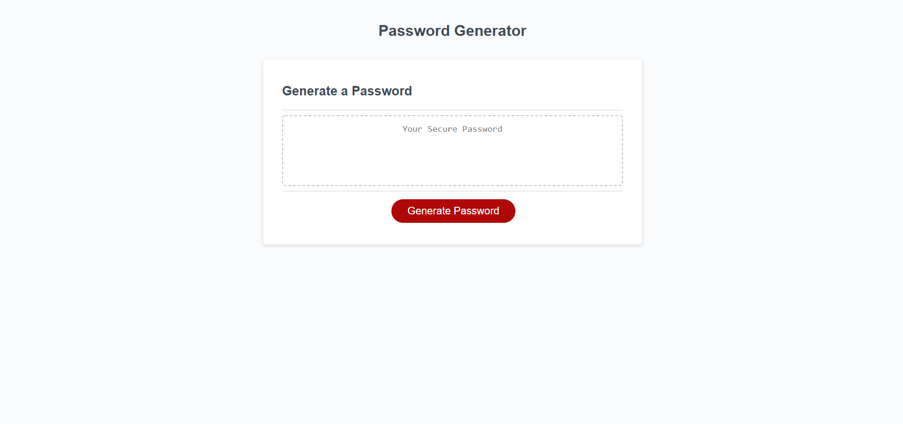

# Week 3 Random Password Generator Assignment 

### By Mackenzie Gray

## Technologies Used

- Javascript
- HTML (codebase provided)
- CSS (codebase provided)

## Description 

The motivation for this project was to develop a random password generator that enables the user to generate a random password that meets certain criteria. This is done so that greater security can be achieved for a user with sensitive data. 

## Outline of changes made

- Generation of a number of arrays to be used in the working Javascript code such as array of special characters, numbers, uppercase letters and lowercase letters. 
- Writing of code for the function required to get prompts from the user asking for length of password (including requirements of more than 8 and less than 128 characters), and inclusion of special characters, numbers, uppercase and lowercase characters (at least one of these criteria needed to be selected). 
- Writing of function that generates the random password once character criteria has returned true. This function includes a 'for' loop and subsequent 'math' function to select characters at random from the choice array. 
- Ensuring that written code property communicates with the function that writes the generated code into the text box on the browser. 

## Website URL
[Click Here](https://mdkgray.github.io/password_generator/)

## Screenshots 
